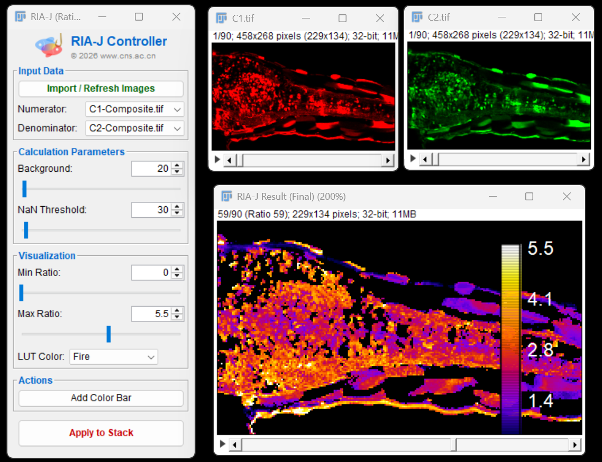

<div align="center">


# RIA-J: Ratio Imaging Analyzer (Java)

**The native ImageJ/Fiji counterpart to the [RIA (Python)](https://github.com/Epivitae/RatioImagingAnalyzer) project.**

[](https://github.com/Epivitae/RIA-J/releases)
[](https://github.com/Epivitae/RIA-J/releases)
[](https://imagej.net/)
[](https://www.java.com/)
[](LICENSE)
[](https://doi.org/10.5281/zenodo.18200077)
</div>

---

## 📖 Overview

**RIA-J** is a lightweight, publication-grade tool designed to bring the rigorous workflow of ratiometric fluorescence analysis directly into the **ImageJ/Fiji** ecosystem. 

It empowers researchers to perform **Background Subtraction**, **Dynamic Masking**, and **Real-time Ratio Calculation** through a modern, user-friendly dashboard. 

**v1.0.0 Update:** Now featuring a **"Direct Stack" workflow**, RIA-J automatically processes entire time-lapse datasets in the background, offering a seamless "What You See Is What You Get" experience.

<div align="center">
  
</div>

*(The modern v1.0 interface with streamlined controls)*

## ✨ Key Features

* **🚀 Direct Stack Workflow**: No need to manually "Apply". The plugin automatically computes the entire ratio stack upon import. Adjustments to parameters are instantly reflected on the current frame and synchronized to the whole stack upon export.
* **🧠 Smart Window Scan**: Automatically detects and lists all open images. It intelligently splits composite images or identifies separate C1/C2 windows, defaulting to the most logical numerator/denominator pair.
* **⚡ Publication-Ready RGB Export**:
    * **RGB Stack**: One-click export of your entire time-lapse analysis as a high-quality RGB video/stack.
    * **Snapshot**: Instantly capture the current frame for figure creation.
    * **Auto-Sync**: Ensures your current visualization settings (LUT, Contrast) are applied to every frame in the exported video.
* **🏷️ Standardized Naming**: Built-in "Filename Cleaner" automatically strips technical prefixes (e.g., `C1-`) and tags outputs (`RIA-Result`, `RIA-RGB`) for organized data management.
* **🎨 AI-Friendly Legend**: Generates a clean, independent color bar window (pure white background, no clutter) designed for easy import into Adobe Illustrator or Inkscape.

## 📥 Installation

### Method 1: Via Fiji Update Site (Recommended ⭐)
This is the easiest way to install RIA-J and keep it updated automatically.

1.  Open **Fiji / ImageJ**.
2.  Navigate to **Help > Update...**
3.  Click the **Manage update sites** button.
4.  Find **RIA-J** in the list and check the box.
    * *If RIA-J is not in the list, click **Add Unlisted Site** and enter:*
    * **Name**: `RIA-J`
    * **URL**: `https://sites.imagej.net/RIA-J/`
5.  Click **Apply and Close**, then click **Apply changes** in the main updater window.
6.  Restart Fiji. You will find it under `Plugins > RIA-J (Ratio Processor)`.

### Method 2: Manual Installation
If you prefer to install a specific version manually:

1.  **Download**: Get the latest **`RIA_J-x.x.x.jar`** file from the [Releases](https://github.com/Epivitae/RIA-J/releases) page.
2.  **Copy**: Move the `.jar` file into your `Fiji.app/plugins/` folder.
3.  **Restart**: Restart ImageJ.
4.  **Run**: Access the tool via `Plugins > RIA-J (Ratio Processor)`.

## 🛠️ Usage Workflow (v1.0)

1.  **Open Images**: Drag your raw data (Single Composite or Split Files) into ImageJ.
2.  **Launch Plugin**: Go to `Plugins > RIA-J > Ratio Analyzer`.
3.  **One-Click Import**: 
    * Click **`Import / Refresh`**. 
    * *The plugin automatically detects channels, splits composites if needed, and computes the initial ratio stack in the background.*
4.  **Interactive Tuning**:
    * Adjust **Background** and **NaN Threshold** to mask noise.
    * Tune **Min/Max Ratio** sliders to optimize the dynamic range.
    * *Changes are reflected immediately on the current frame.*
5.  **Export Results**:
    * **Data**: The `RIA-Result` window already contains the 32-bit raw data for quantification.
    * **Publication**: Click **`Save as RGB`** (Red Button). 
        * Choose to export the **Current Frame (Snapshot)** or the **Entire Stack (Movie)**.
        * The plugin automatically synchronizes your settings to all frames before exporting.

## 📂 Output Files

RIA-J enforces a strict naming convention to keep your data organized:

| File Type | Naming Convention | Bit-Depth | Purpose |
| :--- | :--- | :--- | :--- |
| **Raw Result** | `RIA-Result-[SampleName]` | 32-bit Float | Measurement, Quantification, ROI Analysis |
| **RGB Stack** | `RIA-RGB-Stack-[SampleName]` | 24-bit RGB | Video presentation, PowerPoint, Visual inspection |
| **RGB Snap** | `RIA-RGB-Snap-[SampleName]` | 24-bit RGB | Figure creation (Adobe Illustrator/Inkscape) |

## ⚙️ Build from Source

**Prerequisites**: JDK 8+ and Maven.

```bash
git clone [https://github.com/Epivitae/RIA-J.git](https://github.com/Epivitae/RIA-J.git)
cd RIA-J
mvn clean package
```

The compiled plugin will be generated in `target/RIA_J-1.0.0.jar`.

## 🤝 Contributing

Contributions are welcome! Please fork the repository and submit a Pull Request.

## 📄 License

This project is licensed under the MIT License - see the [LICENSE](LICENSE) file for details.

---
<div align="center">
Developed by Kui Wang. Part of the RIA Project family.
</div>